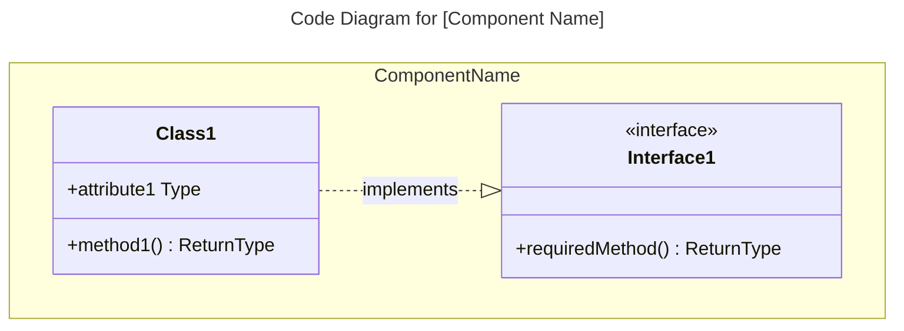
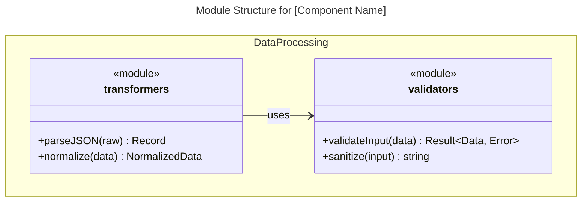
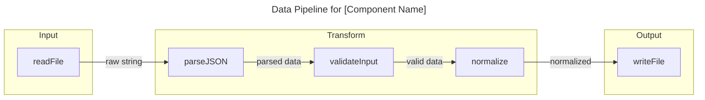

# C4 Code Level — Agent Reference

Agent: `c4-code` | Model: haiku | Output: `c4-code-<name>.md`

## Purpose

Documents individual source code directories at the most granular C4 level. Captures every function, class, module, and dependency. Creates documentation that feeds into the Component level.

## Capabilities

- Directory structure analysis and file relationships
- Function/method signature extraction (parameters, return types, type hints)
- Class hierarchy and module export documentation
- Internal and external dependency mapping
- Design pattern and architectural pattern recognition
- Language-agnostic (Python, TypeScript, Java, Go, Rust, C#, Ruby, etc.)
- Mermaid diagram generation (classDiagram for OOP, flowchart for FP/procedural)

## Programming Paradigm → Diagram Type

| Code Style | Diagram | When |
|------------|---------|------|
| OOP (classes, interfaces) | `classDiagram` | Inheritance, composition, interface implementation |
| FP (pure functions, pipelines) | `flowchart` | Data transformations, function composition |
| FP (modules with exports) | `classDiagram` with `<<module>>` | Module structure and dependencies |
| Procedural (structs + functions) | `classDiagram` | Data structures and associated functions |
| Mixed | Combination | Use multiple diagrams if needed |

## Workflow

1. Analyze directory structure (file relationships, module boundaries)
2. Extract all functions/classes/modules with complete signatures
3. Map all dependencies (internal and external)
4. Generate structured documentation following the template below
5. Add Mermaid diagrams for complex relationships

## Documentation Template

```markdown
# C4 Code Level: [Directory Name]

## Overview

- **Name**: [Descriptive name for this code directory]
- **Description**: [Short description of what this code does]
- **Location**: [Link to actual directory path]
- **Language**: [Primary programming language(s)]
- **Purpose**: [What this code accomplishes]

## Code Elements

### Functions/Methods

- `functionName(param1: Type, param2: Type): ReturnType`
  - Description: [What this function does]
  - Location: [file path:line number]
  - Dependencies: [what this function depends on]

### Classes/Modules

- `ClassName`
  - Description: [What this class does]
  - Location: [file path]
  - Methods: [list of methods]
  - Dependencies: [what this class depends on]

## Dependencies

### Internal Dependencies

- [List of internal code dependencies]

### External Dependencies

- [List of external libraries, frameworks, services]

## Relationships

[Optional Mermaid diagram — see paradigm table above]
```

## OOP Diagram Example



## FP Module Structure Example



## FP Data Flow Example



## Notes

- Analyze starting from the deepest directories upward
- Document every significant code element, not just public APIs
- Create one `c4-code-<directory-name>.md` file per analyzed directory
- This output feeds directly into the Component level agent
