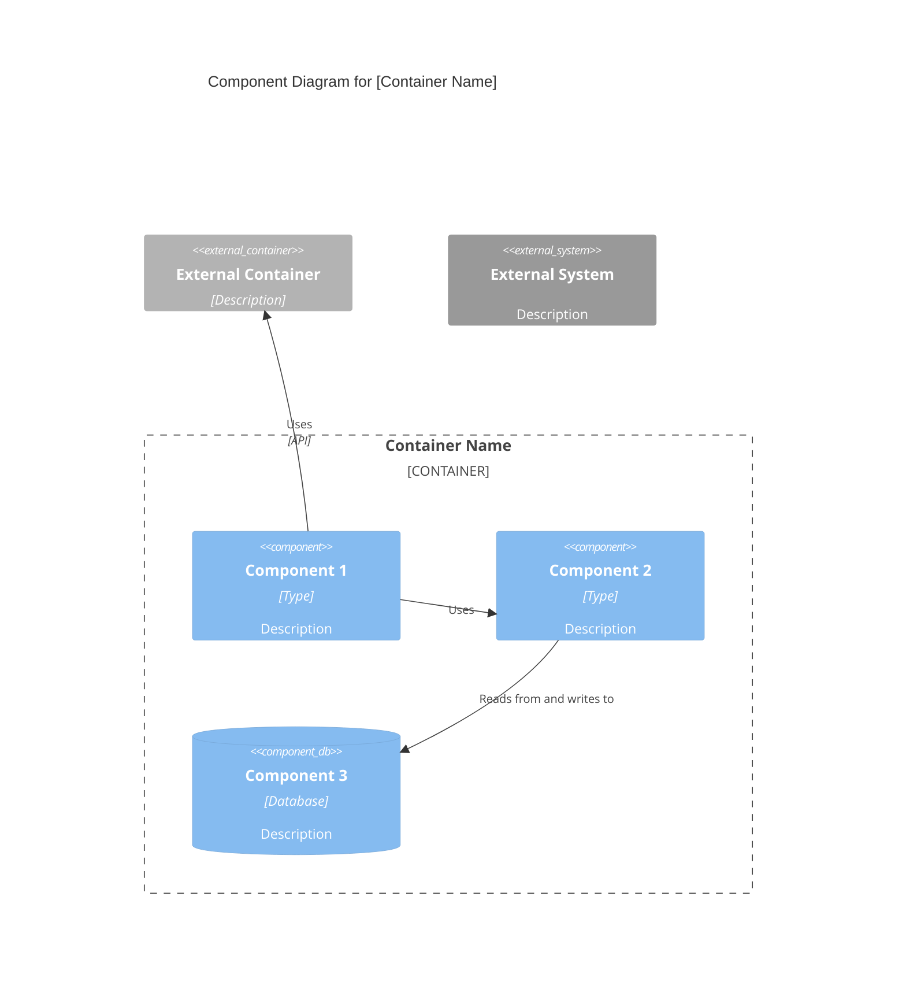

# C4 Component Level — Agent Reference

Agent: `c4-component` | Model: sonnet | Input: `c4-code-*.md` | Output: `c4-component-<name>.md` + index

## Purpose

Synthesizes C4 Code-level documentation into logical, well-bounded components. Defines component interfaces, maps relationships, and creates Component-level diagrams. Bridges code detail with deployment concerns (handled at Container level).

## Core Philosophy

Components represent logical groupings of code that work together to provide cohesive functionality. Boundaries should align with domain, technical, or organizational boundaries. Each component must have clear responsibilities and well-defined interfaces.

## Workflow

1. Review all `c4-code-*.md` files to understand code structure
2. Identify logical component boundaries (domain, technical, or organizational)
3. Define component names, descriptions, and responsibilities
4. List software features provided by each component
5. Link `c4-code-*.md` files to their containing components
6. Document component interfaces (APIs, protocols, data contracts)
7. Map dependencies and relationships between components
8. Generate Mermaid C4Component diagrams
9. Create master `c4-component.md` index with all components

## Documentation Template

```markdown
# C4 Component Level: [Component Name]

## Overview

- **Name**: [Component name]
- **Description**: [Short description of component purpose]
- **Type**: [Application, Service, Library, etc.]
- **Technology**: [Primary technologies used]

## Purpose

[Detailed description of what this component does and what problems it solves]

## Software Features

- [Feature 1]: [Description]
- [Feature 2]: [Description]

## Code Elements

This component contains the following code-level elements:

- [c4-code-file-1.md](./c4-code-file-1.md) - [Description]
- [c4-code-file-2.md](./c4-code-file-2.md) - [Description]

## Interfaces

### [Interface Name]

- **Protocol**: [REST/GraphQL/gRPC/Events/etc.]
- **Description**: [What this interface provides]
- **Operations**:
  - `operationName(params): ReturnType` - [Description]

## Dependencies

### Components Used

- [Component Name]: [How it's used]

### External Systems

- [External System]: [How it's used]

## Component Diagram

[See diagram syntax below]
```

## Component Diagram Syntax

Use `C4Component` Mermaid syntax. Shows components **within a single container**:



## Master Index Template

```markdown
# C4 Component Level: System Overview

## System Components

### [Component 1]
- **Name**: [Component name]
- **Description**: [Short description]
- **Documentation**: [c4-component-name-1.md](./c4-component-name-1.md)

## Component Relationships
[Mermaid diagram showing all components and their relationships]
```

## Key Principles

- Focus on **logical grouping**, not deployment concerns (deferred to Container level)
- Component boundaries should reflect domain or technical cohesion
- Every component needs clear responsibilities and at least one defined interface
- This output feeds directly into the Container level agent
