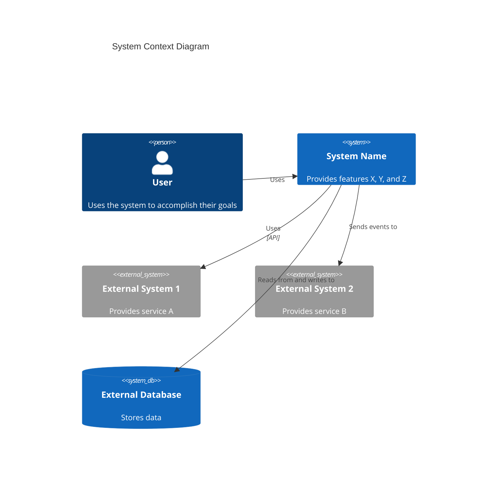

# C4 Context Level — Agent Reference

Agent: `c4-context` | Model: sonnet | Input: Container/component docs + README + tests | Output: `c4-context.md`

## Purpose

Creates the highest-level C4 view: the system as a box surrounded by users and external systems. Focuses on **people and software systems**, not technologies. Produces stakeholder-friendly documentation understandable by non-technical audiences.

## Core Philosophy

Context diagrams show the system boundary, all users (human and programmatic), and all external systems the system interacts with. Technology, protocols, and low-level details are deliberately excluded at this level.

## Workflow

1. Review `c4-container.md` to understand system deployment
2. Review `c4-component.md` to understand system components
3. Review system documentation (README, architecture docs, requirements)
4. Review test files to understand system behavior and features
5. Identify system purpose and boundaries
6. Identify all personas (human users AND programmatic users / external systems)
7. Identify all high-level features provided by the system
8. Map user journeys for each key feature per persona
9. Identify all external systems and dependencies
10. Generate Mermaid C4Context diagram
11. Create comprehensive context documentation

## Documentation Template

```markdown
# C4 Context Level: System Context

## System Overview

### Short Description

[One-sentence description of what the system does]

### Long Description

[Detailed description of the system's purpose, capabilities, and the problems it solves]

## Personas

### [Persona Name]

- **Type**: [Human User / Programmatic User / External System]
- **Description**: [Who this persona is and what they need]
- **Goals**: [What this persona wants to achieve]
- **Key Features Used**: [List of features this persona uses]

## System Features

### [Feature Name]

- **Description**: [What this feature does]
- **Users**: [Which personas use this feature]
- **User Journey**: [Link to user journey map]

## User Journeys

### [Feature Name] - [Persona Name] Journey

1. [Step 1]: [Description]
2. [Step 2]: [Description]
3. [Step 3]: [Description]

### [External System] Integration Journey

1. [Step 1]: [Description]
2. [Step 2]: [Description]

## External Systems and Dependencies

### [External System Name]

- **Type**: [Database, API, Service, Message Queue, etc.]
- **Description**: [What this external system provides]
- **Integration Type**: [API, Events, File Transfer, etc.]
- **Purpose**: [Why the system depends on this]

## System Context Diagram

[See diagram syntax below]

## Related Documentation

- [Container Documentation](./c4-container.md)
- [Component Documentation](./c4-component.md)
```

## Context Diagram Syntax



## Key Principles

- Focus on **people and software systems**, not technologies or protocols
- Show the **system boundary** clearly (what's inside vs. outside)
- Include **all users**: human and programmatic (external systems that call the system are also "users")
- Include all **external systems** the system interacts with
- Keep it **stakeholder-friendly** — avoid implementation details
- Document **user journeys** for each key feature and persona
- This is the final step of the C4 documentation chain
